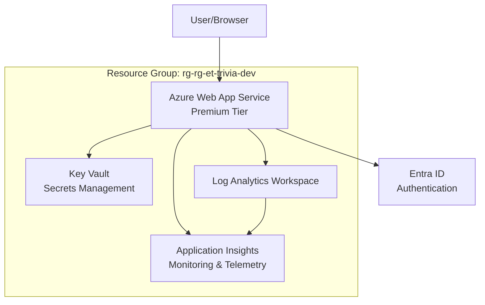

# Azure Deployment Guide

This document provides instructions for deploying the MSAL Passkey Force application to Azure App Service Premium.

## Prerequisites

Before deploying, ensure you have the following installed:

1. **Azure CLI** - [Install Azure CLI](https://docs.microsoft.com/en-us/cli/azure/install-azure-cli)
2. **Azure Developer CLI (azd)** - [Install azd](https://learn.microsoft.com/en-us/azure/developer/azure-developer-cli/install-azd)
3. **Node.js 18 LTS** - [Install Node.js](https://nodejs.org/)

## Deployment Options

### Option 1: PowerShell Script (Recommended)

Run the comprehensive PowerShell deployment script:

```powershell
# Preview deployment (see what will be created without making changes)
.\deploy-to-azure.ps1 -Preview

# Deploy to development environment (default)
.\deploy-to-azure.ps1

# Deploy to production with custom location
.\deploy-to-azure.ps1 -EnvironmentName "prod" -Location "eastus"
```

### Option 2: Batch Script (Simple)

Run the simple batch file:

```batch
deploy-to-azure.bat
```

### Option 3: Manual AZD Commands

If you prefer to run commands manually:

```bash
# Set environment variables
$env:AZURE_ENV_NAME = "dev"
$env:AZURE_LOCATION = "westus2"

# Build the application
npm install
npm run build

# Deploy to Azure
azd init --environment dev --location westus2
azd up --environment dev
```

## Deployed Resources

The deployment will create the following Azure resources in the resource group `rg-rg-et-trivia-dev`:

- **App Service**: `app-play-et-trivia-toronto-hub-dev` (Premium P1V2)
- **App Service Plan**: Premium tier with auto-scaling
- **Key Vault**: For secure storage of application secrets
- **Application Insights**: For monitoring and telemetry
- **Log Analytics Workspace**: Centralized logging
- **Managed Identity**: For secure access to Azure services

## Post-Deployment Configuration

After successful deployment, complete these steps:

### 1. Configure Entra ID Application

1. Go to [Azure Portal](https://portal.azure.com) → Entra ID → App registrations
2. Create or update your application registration
3. Configure redirect URIs to include your deployed app URL
4. Note the Application (client) ID and Directory (tenant) ID

### 2. Update Key Vault Secrets

Add the following secrets to your Key Vault:

```bash
# Using Azure CLI
az keyvault secret set --vault-name <key-vault-name> --name "AZURE-CLIENT-ID" --value "<your-client-id>"
az keyvault secret set --vault-name <key-vault-name> --name "AZURE-CLIENT-SECRET" --value "<your-client-secret>"
az keyvault secret set --vault-name <key-vault-name> --name "AZURE-TENANT-ID" --value "<your-tenant-id>"
```

### 3. Update Application Settings

Update the Web App configuration to reference Key Vault secrets:

```bash
az webapp config appsettings set --resource-group rg-rg-et-trivia-dev --name app-play-et-trivia-toronto-hub-dev --settings \
  AZURE_CLIENT_ID="@Microsoft.KeyVault(VaultName=<vault-name>;SecretName=AZURE-CLIENT-ID)" \
  AZURE_CLIENT_SECRET="@Microsoft.KeyVault(VaultName=<vault-name>;SecretName=AZURE-CLIENT-SECRET)" \
  AZURE_TENANT_ID="@Microsoft.KeyVault(VaultName=<vault-name>;SecretName=AZURE-TENANT-ID)"
```

## Monitoring and Logs

### Application Insights

Access application telemetry at:
- Azure Portal → Application Insights → your-app-insights-resource

### Log Analytics

Query logs using KQL:
- Azure Portal → Log Analytics → your-workspace → Logs

### Application Logs

View real-time logs:

```bash
# Using azd
azd app-log get

# Using Azure CLI
az webapp log tail --resource-group rg-rg-et-trivia-dev --name app-play-et-trivia-toronto-hub-dev
```

## Troubleshooting

### Common Issues

1. **Build Failures**
   - Ensure Node.js 18 LTS is installed
   - Check that all dependencies are properly listed in package.json
   - Verify the build script runs locally: `npm run build`

2. **Authentication Issues**
   - Verify Entra ID configuration
   - Check Key Vault access policies
   - Ensure secrets are properly configured

3. **App Service Issues**
   - Check Application Insights for errors
   - Review application logs
   - Verify environment variables are set correctly

### Getting Help

1. Check deployment logs in Azure Portal
2. Review Application Insights for runtime errors  
3. Use Azure CLI to diagnose issues:
   ```bash
   az webapp show --resource-group rg-rg-et-trivia-dev --name app-play-et-trivia-toronto-hub-dev
   ```

## Architecture



## Security Features

- **HTTPS Only**: All traffic encrypted in transit
- **Managed Identity**: Secure access to Azure services without credentials
- **Key Vault Integration**: Secrets stored securely and accessed via managed identity
- **Application Insights**: Comprehensive monitoring and alerting
- **Premium App Service**: Enhanced security, performance, and compliance features

## Cost Optimization

- App Service Premium P1V2: ~$73/month
- Key Vault Standard: ~$3/month + transaction costs
- Application Insights: Pay-per-GB ingestion
- Log Analytics: Pay-per-GB ingestion and retention

Total estimated monthly cost: ~$80-100 depending on usage.

## Scaling

The Premium App Service Plan supports:
- Auto-scaling based on CPU, memory, or custom metrics
- Up to 30 instances
- Load balancing across multiple instances
- Custom domains and SSL certificates